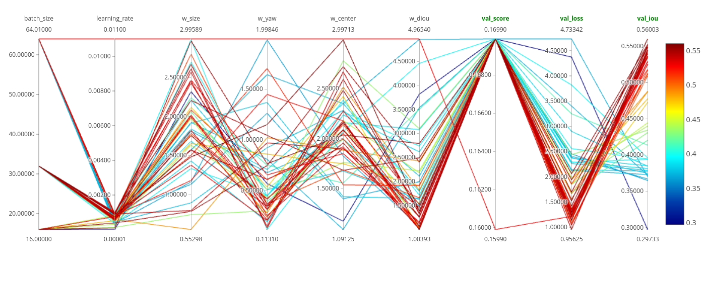
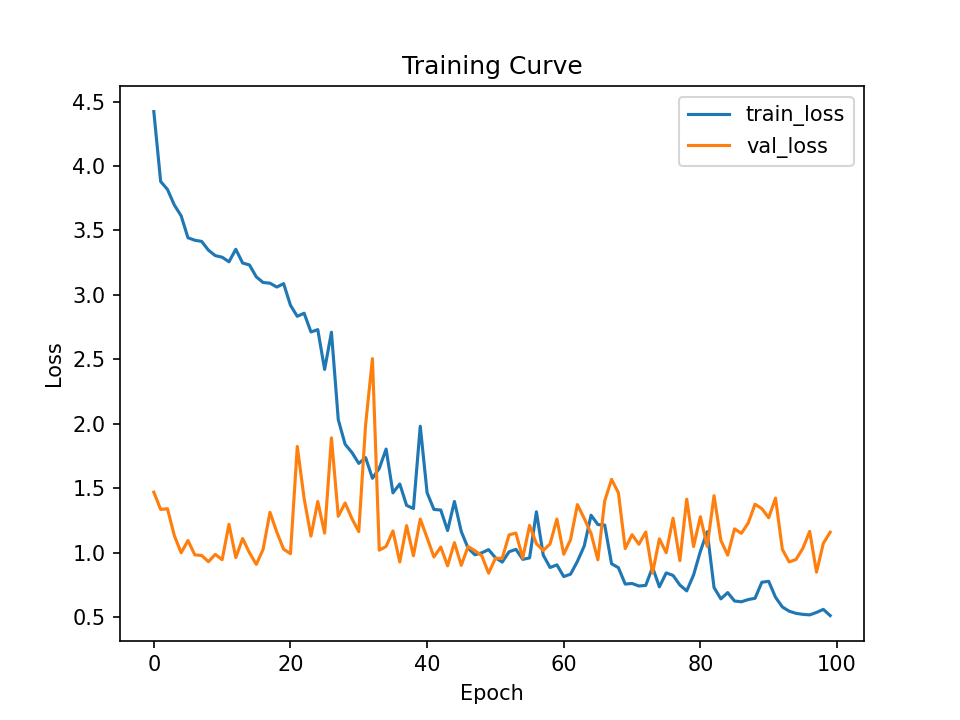
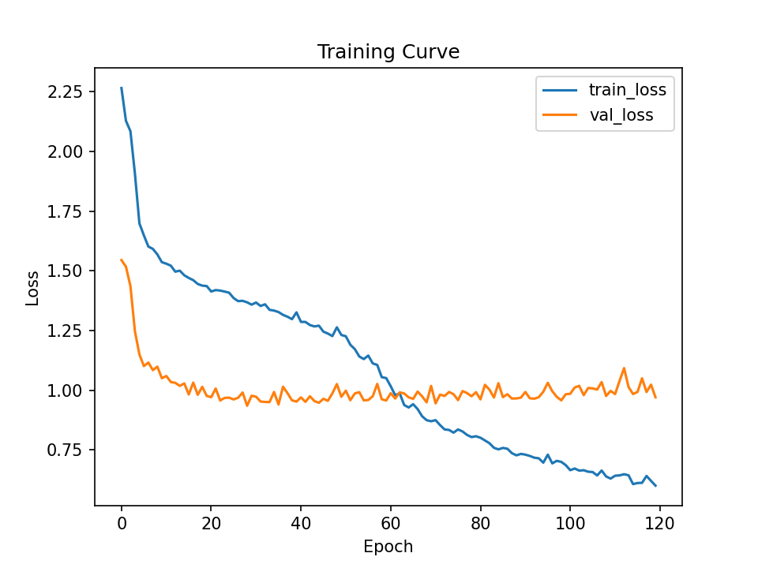
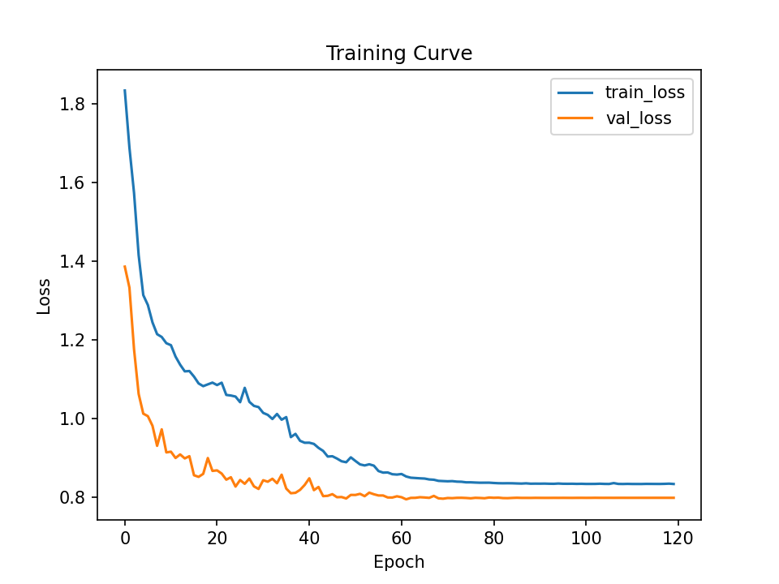
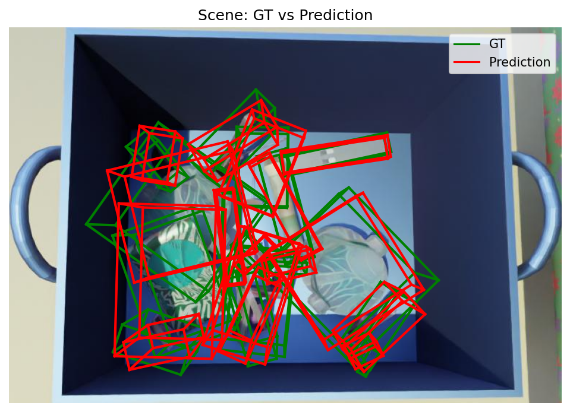
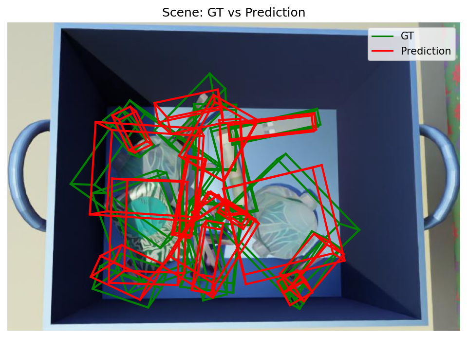
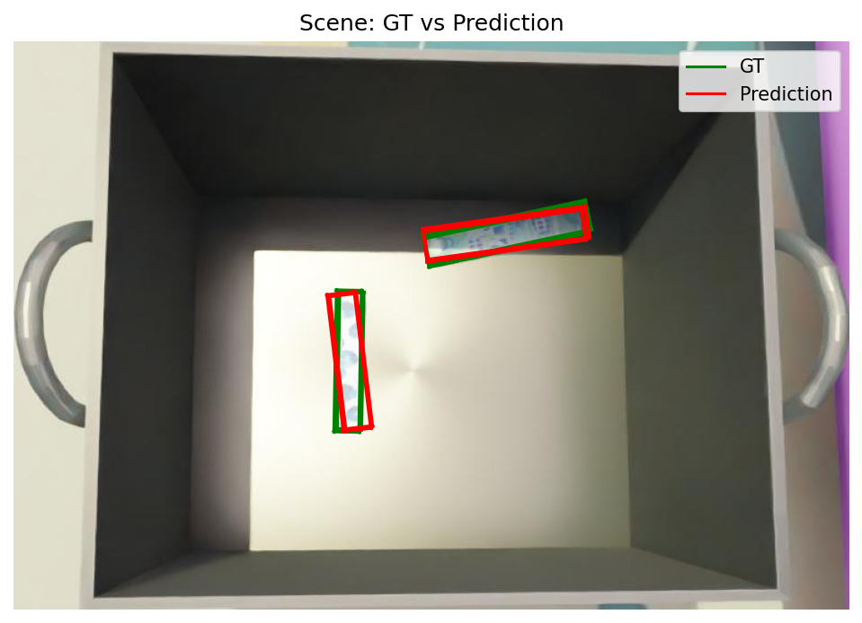
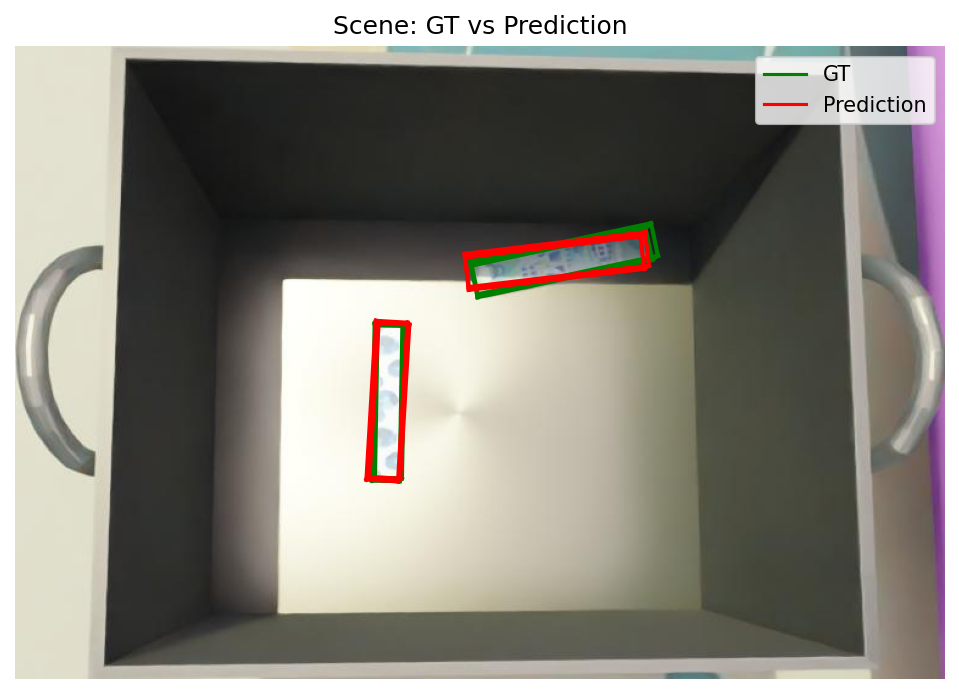

# 3D Bounding Box Prediction


## Demo


 
## Usage
### Quick Start

```bash
uv sync
uv run train --data_path "/path/to/dataset"
```
### Training

Train the model from scratch:
```bash
uv run train \
  --data_path "/path/to/dataset" \
  --lr 1e-4 \
  --batch_size 64 \
  --epochs 200
```

Train using tuned hyperparameters:
```bash
uv run train \
  --data_path "/path/to/dataset" \
  --use_tuned \
```
---

### Hyperparameter Tuning

Run hyperparameter search:

```bash
uv run tune --config configs/tune.yaml
```

---

### Evaluation

Evaluate a trained model:

```bash
uv run test \
  --data_path "/path/to/dataset" \
  --checkpoint "/path/to/model"
```
With visualization:

```bash
uv run test \
  --data_path "/path/to/dataset" \
  --checkpoint "/path/to/model" \
  --show_vis \
  --save_vis
```

## 1. Overview

This project builds an end-to-end pipeline for **3D bounding box prediction from point cloud data**, focusing on accurate **scale and orientation estimation**.

Key highlights:
- PointNet-based model for object-level 3D regression  
- Strong improvements in **geometry understanding (size + yaw)**  
- ~**0.60 IoU** achieved through loss design and training optimization  
- ONNX inference with ~**2× speedup**  
---
## 2. Project Pipeline

```text
Raw Data
   ↓
Preprocessing (object extraction + normalization)
   ↓
Dataset Loader (PyTorch Dataset)
   ↓
Model (PointNet-based)
   ↓
Loss Function (MSE + DIoU)
   ↓
Training Loop (logging + checkpointing)
   ↓
Evaluation (IoU metrics)
   ↓
Visualization (GT vs Predictions)
```

## 3. Data Processing

### 3.1 Object Extraction

- Instance masks are used to extract **object-level point clouds**  
- This reformulates the task into a **single-object 3D bounding box regression problem**  


### 3.2 Preprocessing

The following preprocessing steps are applied to each object:

- **Depth filtering:**  
  Remove invalid points with non-positive depth (`Z ≤ 0`)  

- **Outlier removal:**  
  Apply percentile-based filtering to eliminate extreme values  

- **Normalization:**  
  Center and scale point clouds for stable training  

- **Point sampling:**  
  Subsample points to a fixed size based on distribution analysis  

- **Bounding box parameterization:**  
  Convert 3D box corners into a compact representation  
  *(center, size, yaw)*  

---

## 4. Model Architecture

The model is a **PointNet-style network** designed for **unordered point clouds**.
Start from the basic model and improve as we go.

### Key Idea:
- Learn **point-wise features**
- Aggregate using a **symmetric function (max pooling)**

### Implementation

- Input: `(B, N, 3)`
- Output: `(center, size, yaw)`

### Model Architecture

- **Input:** 3D points (x, y, z)
- **Feature extractor (MLP):** 3 → 64 → 128 → 256
- **Regression head:** 256 → 256 → 128 → 7  
- **Output:** Parametrized 3D bounding box (center, size, yaw)

```text
(B, N, 3)
   │
   ▼
MLP: 3 → 64 → 128 → 256
   │
   ▼
Max Pool
   │
   ▼
Global (256)
   │
   ▼
FC: 256 → 256 → 128 → 7
   │
   ▼
Bounding Box
```

#### Output:
Parametrized Bounding Box
- Center → (x, y, z)
- Size → (dx, dy, dz) 
- Yaw → rotation angle

---
## 5. Loss Function
Weighted multi component loss.
### Components:
1. **Center Loss** (MSE)
2. **Size Loss** (log-space MSE)
3. **Yaw Loss** : Orientation loss
4. **DIoU Loss** : Encourages overlap, correct center alignment
```
L = w1*L_center + w2*L_size + w3*L_yaw + w4*L_diou
```


## 6. Training Pipeline

### Features:
- Batch training using PyTorch DataLoader
- Loss logging (per component)
- Validation loop
- Best model tracking


### Hyperparameters Tuned:
- Learning rate
- Batch size
- Loss weights

### Experiment Tracking
- MLflow used for logging:
  - Hyperparameters
  - Loss values
  - Evaluation metrics
- Training and validation loss curves saved for analysis


### Hyperparameter Tuning

Hyperparameters were optimized using **Optuna**, exploring:

- Training parameters:
  - Learning rate
  - Batch size
- Loss weights:
  - `w_center`, `w_size`, `w_yaw`, `w_diou`

**Validation Objective:**
```python
val_score = val_loss - 2.0 * val_iou
```



#### Key Findings

- **Learning rate**: lower values perform better
- **Batch size** has a moderate impact on generalization  
- **Loss weights** have limited sensitivity, but:
  - **DIoU** contributes significantly to spatial alignment  
- The primary challenge is **orientation (yaw) estimation**  

### Training Evolution

| Run 1  | Run 2  | Run 3  |
| :---: | :---: | :---: |
|  |  |  |
| **Baseline** | **+ DIoU** | **+ Cosine Yaw + Scheduler** |
| - High validation noise<br>- Weak geometry learning | - Better alignment<br>- Reduced loss | - Stable training<br>- Minimal train/val gap<br>- Best performance |

### Training Insights

- Initial training struggled with **geometry (size + orientation)** rather than localization  
- Adding **DIoU loss** significantly improved bounding box alignment  
- Using a **cosine-based yaw loss** resolved angular discontinuity issues  
- A **learning rate scheduler** improved convergence stability and generalization  

**Overall:** Improvements in geometric understanding directly translated to higher IoU.

---
## 7. Evaluation

### Metrics
- 3D IoU 
- Loss breakdown:
  - Center Loss
  - Size Loss
  - Yaw Loss

---

### Evaluation Results

| Metric        | Run 1  | Run 2  | Run 3  | Improvement (Run 1 → 3) |
|--------------|--------|--------|--------|--------------------------|
| Mean IoU     | 0.3773 | 0.5825 | 0.5966 | ↑ +0.2193                |
| Total Loss   | 1.1945 | 0.8801 | 0.7099 | ↓ -0.4846                |
| Center Loss  | 0.0774 | 0.0729 | 0.0597 | ↓                        |
| Size Loss    | 0.4319 | 0.0801 | 0.0823 | ↓↓↓                      |
| Yaw Loss     | 0.6852 | 0.3009 | 0.1580 | ↓↓↓                      |

---


### Observations

- Large improvement in **Mean IoU** (+0.22), indicating significantly better 3D box alignment  
- **Size and yaw losses** show the biggest reductions → major gains in geometric understanding  
- **Center loss** was already low, suggesting localization was not the primary bottleneck  
- Adding **DIoU loss** and improving orientation modeling had the most impact on performance  

Overall, improvements are primarily driven by better **scale and orientation estimation**, which directly translates to higher IoU.

### Results

| Scene | Run 2 (DIoU) | Run 3 (Final) |
| :---: | :---: | :---: |
| Scene 0 |  |  |
| Scene 1 |  |  |


## 8. Visualization

A custom visualization module was implemented for qualitative analysis and debugging of 3D predictions.

---

### Features

- Projection of 3D point clouds onto the image plane  
- Overlay of:
  - Point cloud  
  - Instance masks  
  - Ground truth bounding boxes  
  - Predicted bounding boxes 

---

## 9. Inference Optimization
To deploy and improve inference performance , the trained PyTorch model was exported to **ONNX** and benchmarked.

---

### Benchmark Setup

```bash
python scripts/benchmark/benchmark_compare.py \
    --onnx deployment/model.onnx \
    --model "/path/to/model"
```
### Results
The model was exported to ONNX and benchmarked using ONNX Runtime (CPU).

| Framework | Inference Time | FPS   |
|----------|---------------|-------|
| PyTorch  | 4.961 ms      | ~201  |
| ONNX     | 2.517 ms      | ~397  |

## Future Work

- Extend to **multi-object detection** (scene-level)  
- Explore improved architectures (e.g., **PointNet++**, transformers)  
- Enhance orientation modeling (e.g., bin-based methods)  
- Use better sampling techniques(e.g., Farthest Point Sampling)  
- Refine loss design for improved IoU alignment  
- Enable **real-time inference** with TensorRT  

## Project Structure

```text
.
├── src/                
│   ├── model.py
│   ├── loss.py
│   ├── data/           # Dataset + preprocessing
│   ├── train/          # Training logic
│   ├── metrics/        # Evaluation 
│   └── utils/
├── scripts/            # Training / evaluation / export
│   ├── train.py
│   ├── test.py
│   ├── tune.py
│   ├── export_onnx.py
│   └── benchmark_*.py
├── configs/            # Hyperparameters & tuning configs
├── notebooks/          # Workflow experimentation
├── outputs/            # Models, plots, visualizations
├── deployment/         # ONNX model
├── data/               # Sample dataset
└── README.md

```